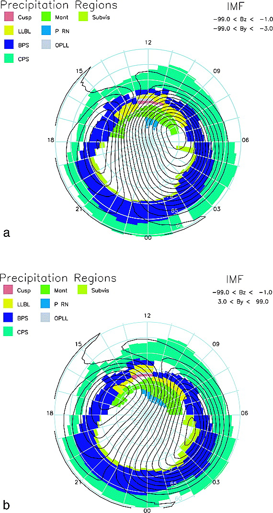
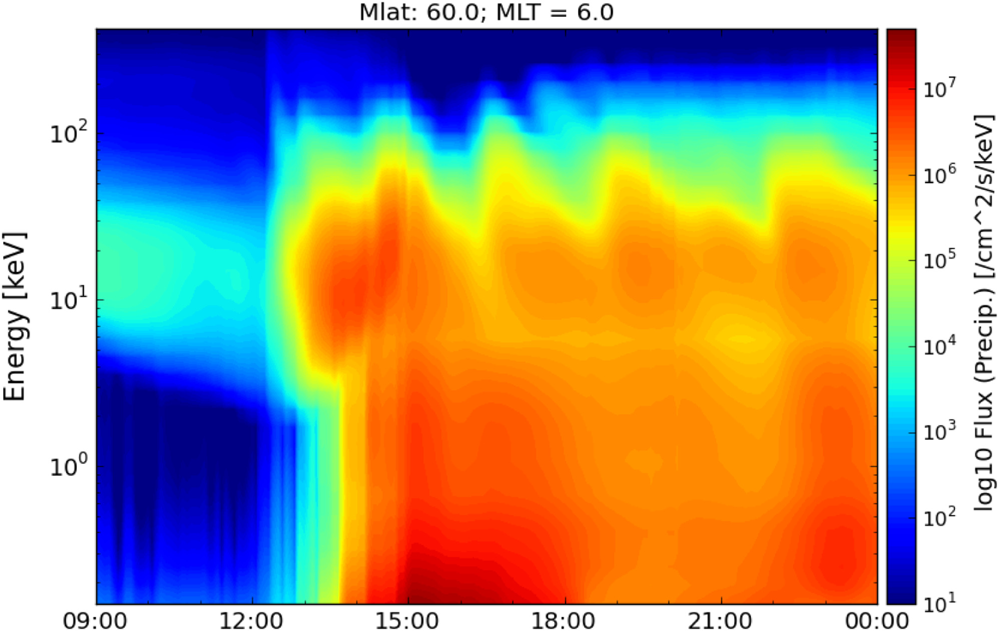
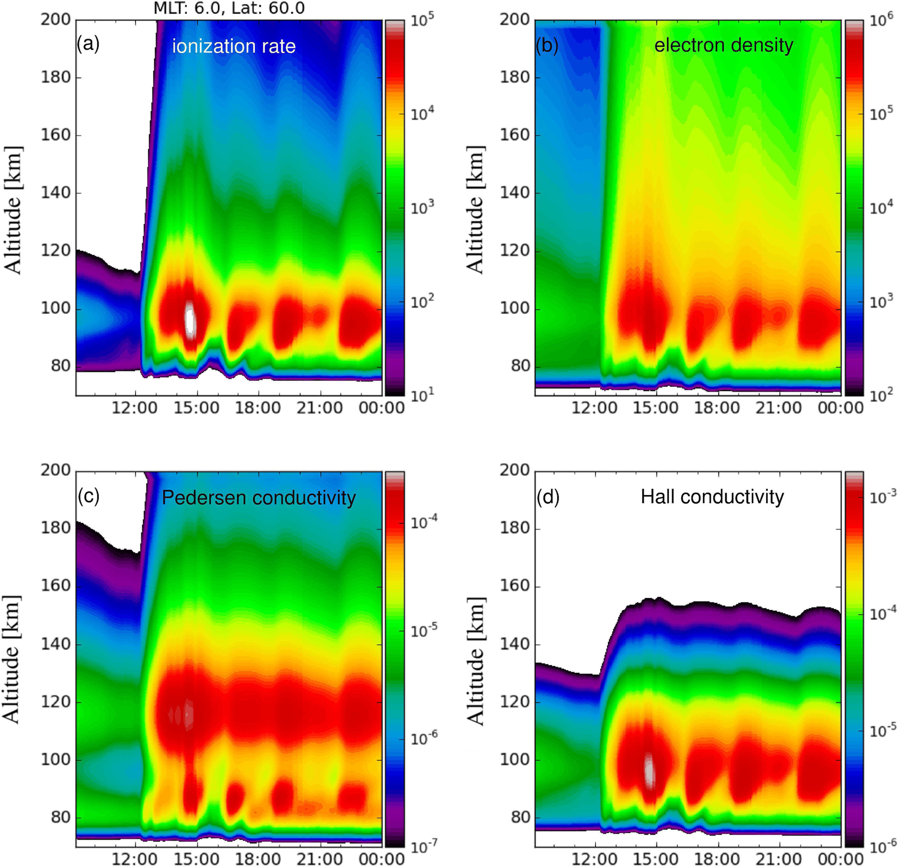
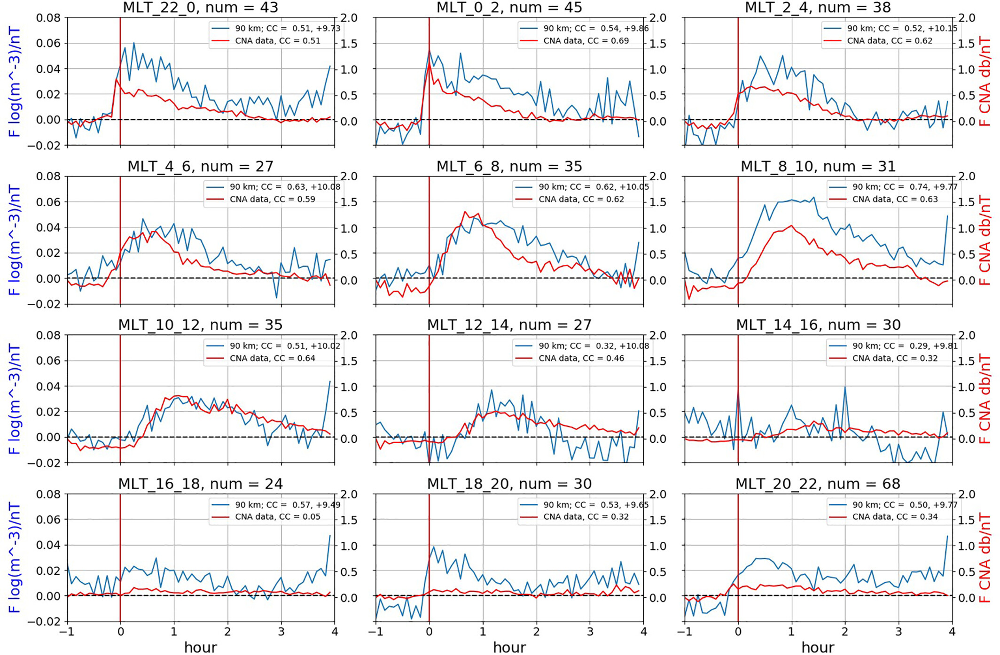
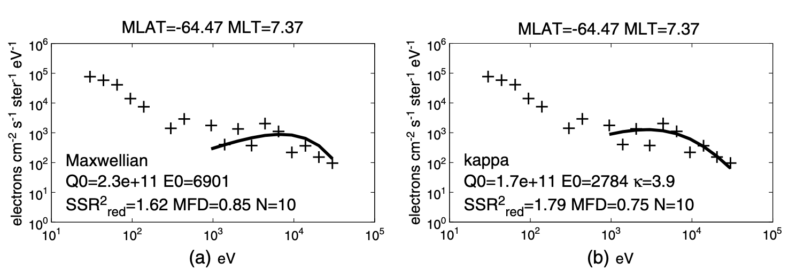
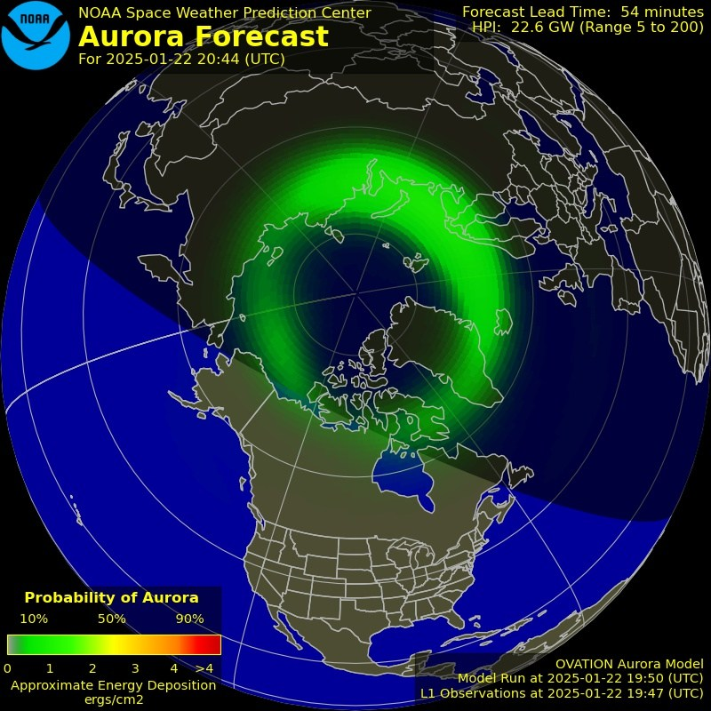
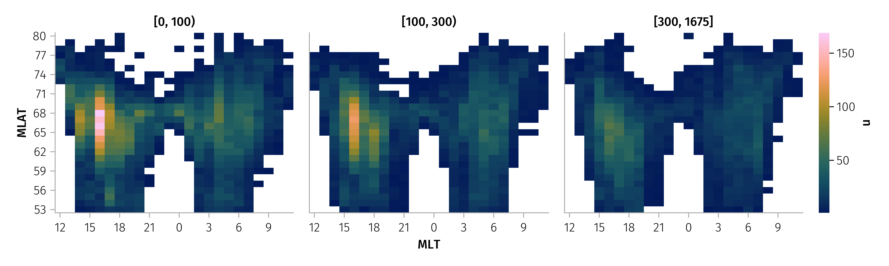
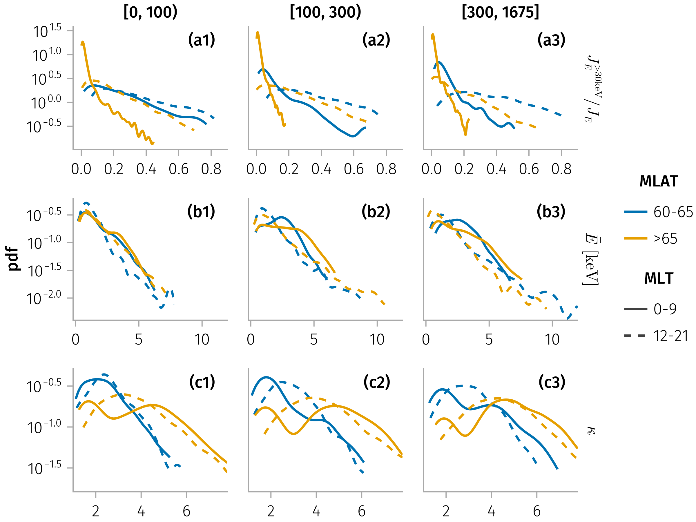

## Magnetosphere-ionosphere (MI) coupling

**Electron precipitation (EP)** couples the magnetosphere and ionosphere by creating ionization and controlling high‑latitude conductances. 

::: {.notes}
> The magnetospheric substorm is a fundamental component of geomagnetic activity, resulting in rapid energization of charged particles in the near‐Earth magnetotail (see reviews by Birn et al., 2021; Sitnov et al., 2019, and references therein), followed by their subsequent injection into the inner magnetosphere (see reviews by Baker et al., 1996; Gabrielse et al., 2022, and references therein). Energetic ions drift duskward, contributing to magnetosphere‐ionosphere coupling, through processes such as sub‐auroral polarization streams (SAPS) (see review Mishin & Streltsov, 2021, and references therein). Conversely, energetic electrons drift dawnward and contribute, through their scattering and precipitation, to ionization and heating of the ionosphere (C. J. Rodger et al., 2022; Thorne et al., 2010). Substorm injections are mesoscale and transient phenomena (e.g., Gabrielse et al., 2014; Nakamura et al., 2002; Sorathia et al., 2021). While the importance of substorm injection energy input into the ionosphere has been recognized and actively investigated (see review Gabrielse et al., 2022; Jordanova et al., 2023; Yu et al., 2022, and references therein), quantifying it is challenging due to the transient nature of injections (see discussions in Heelis & Maute, 2020; C. Huang, 2021).
:::

## Electron precipitation (EP)

<!-- Maps of ionospheric precipitation according to the source region, with superposed inertial convection streamlines -->

## Empirical models

ionospheric electron density profiles and conductance

@robinsonCalculatingIonosphericConductances1987

$$
\begin{aligned}
& \Sigma_P^e=\frac{40<E^e>}{16+<E^e>^2} \sqrt{F_E^e} \\
& \Sigma_H^e=0.45<E^e>^{0.85} \Sigma_P^e
\end{aligned}
$$

where $\Sigma_P^e, \Sigma_H^e$ are the Pedersen and Hall conductances induced by precipitating electrons, $<E^e>, F_E^e$ are the average energy and energy flux of precipitating electrons.

## Electron precipitation (EP) during substorms

## Deep penetration down to the E/D‐layer

## Energetic electron precipitation (EEP)

> A crucial element of substorm injections is the energetic electron precipitation (EEP) into the ionosphere (e.g., Gabrielse et al., 2019; Gkioulidou et al., 2012; Sergeev et al., 2020). Depending on their energy, precipitating electrons can penetrate down to the E/D‐layer (below 80 km, see Nikolaev et al., 2021; Oyama et al., 2017; Stepanov et al., 2021), where they can impact ionospheric chemistry (Mironova et al., 2019; Seppälä et al., 2015; Verronen et al., 2021), lead to mesospheric ozone loss (Chapman‐Smith et al., 2023), increase local conductance (Yu et al., 2018), and contribute to large‐scale ionosphere disturbances (Lyons et al., 2021; Nishimura et al., 2021).

## Spectral characteristics and distributions

::: {.notes}
> The spectral distributions of auroral particles play a fundamental role in the construction of the global distribution of auroral particles and conductivities @mcintoshMapsPrecipitatingElectron2014
:::

<!-- 

-->

## Challenges to understanding MI coupling

> “Large-scale models of the ionosphere [e.g., Quegan et al., 1981; Schunk and Szuszczewicz, 1988; Daniell et al., 1995] require accurate specification of the ionization due to auroral particles, while global thermospheric models [e.g., Roble et al., 1982; Fuller-Rowell et al., 1984; Roble and Ridley, 1994; Ridley et al., 2006; Deng et al., 2013] depend heavily on knowledge of the ionospheric conductivity for calculations of the neutral atmosphere response to ion drag and Joule heating.” @mcintoshMapsPrecipitatingElectron2014

## Challenges to understanding MI coupling

> The remaining limitations to OP-2013 most likely to be felt by users include a limitation to 30 keV (extrapolated to about 50 keV). Although higher energy precipitation contributes relatively little to the total energy budget, the deeper penetration into the atmosphere of high energy particles has important consequences for upper atmosphere chemistry. More detailed spectral information would also be quite useful for many modeling purposes. (***@newellOVATIONPrime2013Extension2014***)

## Fitting is tricky

## Results

## Integrated Fluxes and Ratio in Different AE regime

![Median distributions of (a) total energy flux [$keV cm^{-2} s^{-1} sr^{-1}$], (b) total number flux [$cm^{-2} s^{-1} sr^{-1}$], and (c-d) fractional contribution of energetic particles (>30 keV) to total energy and number flux.](figures/e30_flux_ratio_mlt_mlat_median.png)

---

![Median distributions of (a) averaged energy ($\overline{E}$) [$keV$] and (b) kappa parameter ($κ$) as functions of MLT and MLAT, sorted by AE index levels.](figures/key_params_mlt_mlat_median.pdf)

---

## Results

- The contribution of energetic electrons to the total precipitating energy flux can reach, on average, $\sim 40\%$, and for individual events can be as high as $\sim 80\%$. Such large contributions are most frequently observed on the dusk flank at sub-auroral latitudes, while a significant average contribution is also present in the post-midnight sector. 
- The average electron energy is maximized in the post-midnight sector and reaches, on average, $\sim 5$ keV, whereas for individual events on the dusk flank it can be as large as $\sim 10$ keV.
- The energetic component of precipitating electron spectra is well described by a power-law distribution with $\kappa < 3$ at sub-auroral latitudes and $\kappa > 3$ (corresponding to nearly Maxwellian spectra) at auroral latitudes.

## References